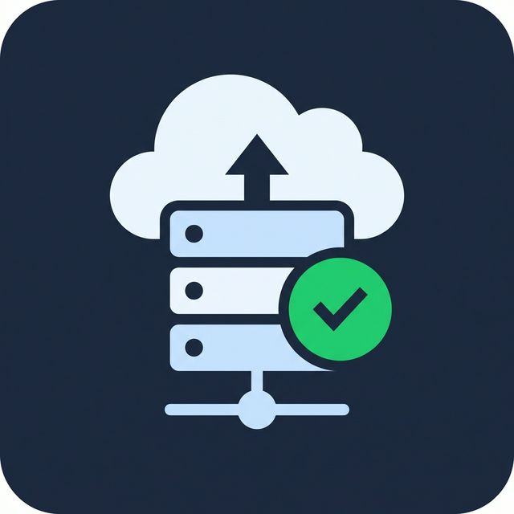

<div align="center">



# Dokploy Status

**Monitor your [Dokploy](https://dokploy.com) deployments directly from VS Code.**

[](https://code.visualstudio.com/)
[](LICENSE)
[](https://github.com/skypedumont/dokploy-status-extension-vscode/releases)

</div>

---

## ✨ Features

| Feature | Description |
|---------|-------------|
| 🗂️ **Sidebar Tree View** | Lists all projects and applications with live status icons |
| 📊 **Status Bar** | Shows aggregate deployment health at a glance |
| 🔄 **Auto Refresh** | Polls for status updates every 30 seconds |
| 🔗 **Quick Access** | Click any application to open its Dokploy dashboard |
| ⚙️ **Config Watcher** | Automatically refreshes when settings change |

### Status Icons

| Icon | Status | Meaning |
|:----:|--------|---------|
| ✅ | `done` | Deployed successfully |
| 🔄 | `running` | Deployment in progress |
| ❌ | `error` | Deployment failed |
| ⚪ | `idle` | Application is idle |

---

## 🚀 Getting Started

### 1. Install the Extension

Download the latest `.vsix` from [Releases](https://github.com/skypedumont/dokploy-status-extension-vscode/releases) and install it:

```
Cmd+Shift+P → Extensions: Install from VSIX...
```

### 2. Configure Settings

Open **Settings** (`Cmd+,` / `Ctrl+,`) and search for `dokployStatus`:

| Setting | Description | Required |
|---------|-------------|:--------:|
| `dokployStatus.apiUrl` | Your Dokploy instance URL (e.g. `https://dokploy.example.com`) | ✅ |
| `dokployStatus.apiKey` | API Key from Dokploy | ✅ |

> **💡 Tip:** Generate your API key in Dokploy under **Settings → Profile → API/CLI**.

### 3. Done!

A **Dokploy** icon appears in the Activity Bar. Expand projects to see application statuses. The status bar shows the overall health of your deployments.

---

## 🔧 Development

```bash
# Clone the repository
git clone https://github.com/skypedumont/dokploy-status-extension-vscode.git
cd dokploy-status-extension

# Install dependencies
npm install

# Compile TypeScript
npm run compile

# Watch for changes (development)
npm run watch

# Package as VSIX
npx @vscode/vsce package --no-dependencies
```

### Debugging

Press **F5** in VS Code to launch the Extension Development Host with the extension loaded.

---

## 📁 Project Structure

```
dokploy-status-extension/
├── src/
│   ├── extension.ts          # Extension entry point, status bar, commands
│   ├── dokployApi.ts          # Dokploy REST API client
│   └── treeDataProvider.ts    # Sidebar tree view with project/app hierarchy
├── media/
│   ├── icon.png               # Marketplace icon (128×128)
│   └── icon.svg               # Activity bar icon
├── package.json               # Extension manifest & configuration
├── tsconfig.json              # TypeScript config
└── .vscode/launch.json        # Debug configuration
```

---

## 🔌 Dokploy API

This extension uses the [Dokploy REST API](https://docs.dokploy.com) with the `x-api-key` header for authentication. It calls the `/api/project.all` endpoint to fetch all projects and their applications, including status information.

**Required API permissions:** Read access to projects and applications.

---

## 📝 Changelog

See [CHANGELOG.md](CHANGELOG.md) for a full list of changes.

---

## 📄 License

This project is licensed under the [MIT License](LICENSE).

---

<div align="center">
  <sub>Built with ❤️ for the Dokploy community</sub>
</div>
